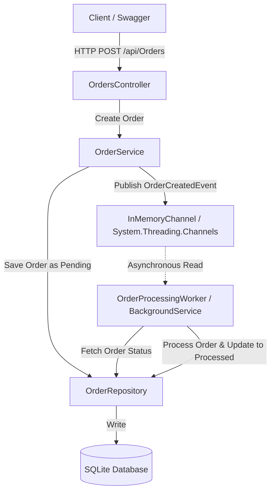

# Reactive Order System

A production-ready, asynchronous Order Processing System built with **.NET 8 Web API** following **Clean Architecture** principles. This system leverages in-memory high-performance queues (`System.Threading.Channels`) for a reactive Pub/Sub messaging pattern to process orders asynchronously in the background, backed by a SQLite database with Entity Framework Core.

---

## Architecture Overview

The system is organized to decouple API request handling from heavy order processing tasks:



1. **API Controller (`OrdersController`)**: Exposes REST endpoints to submit and retrieve orders.
2. **Core Domain (`Core`)**: Contains business entities (`Order`, `OrderItem`), request/response models, and service/repository interfaces defining the core business logic.
3. **Infrastructure & Data (`Infrastructure`)**: Handles database persistence via EF Core with SQLite (`OrderDbContext`), repository implementation, and the in-memory Pub/Sub channel implementation using `System.Threading.Channels`.
4. **Background Worker (`Workers`)**: A hosted service (`OrderProcessingWorker`) that consumes order events reactively and executes the simulated order processing workflow asynchronously.

---

## Core Technologies

- **Runtime**: .NET 8.0
- **Database**: SQLite (with EF Core)
- **Messaging**: `System.Threading.Channels` (Unbounded, single-reader, multi-writer channel)
- **Background Processing**: Hosted `BackgroundService`

---

## Project Directory Structure

```text
ReactiveOrderSystem/
│
├── ReactiveOrderProcess.sln              # Visual Studio Solution
└── ReactiveOrderProcess/                  # Web API Project
    ├── Constants/                         # Application-wide constants (e.g., OrderStatus)
    ├── Controllers/                       # REST API Controllers (OrdersController)
    ├── Core/                              # Core Domain Layer
    │   ├── Entities/                      # Database Entities (Order, OrderItem)
    │   ├── Interfaces/                    # Service and Repository contracts
    │   └── Models/                        # DTOs (Requests & Responses)
    ├── Infrastructure/                    # Infrastructure Layer
    │   ├── Data/                          # EF Core DbContext and migrations
    │   │   └── Repositories/              # Repository implementation
    │   └── Messaging/                     # Pub/Sub channel implementation
    ├── Workers/                           # Background worker services
    ├── Program.cs                         # Application entry point and dependency injection
    └── appsettings.json                   # Configuration settings
```

---

## API Endpoints

### 1. Create a New Order
Submits a new order to the system. The order is immediately saved with a `Pending` status, and an event is published to the background queue for asynchronous processing.

* **URL**: `/api/Orders`
* **Method**: `POST`
* **Content-Type**: `application/json`

**Sample Request Body**:
```json
{
  "customerName": "John Doe",
  "productItems": [
    {
      "productName": "Wireless Mouse",
      "quantity": 2,
      "price": 25.50
    },
    {
      "productName": "Mechanical Keyboard",
      "quantity": 1,
      "price": 89.99
    }
  ]
}
```

**Sample Response Body (200 OK)**:
```json
{
  "statusCode": 200,
  "message": "Order created successfully. Processing has been initiated.",
  "orderId": 1,
  "status": "Pending"
}
```

---

### 2. Get All Orders
Retrieves a list of all orders in the system along with their line items and current processing status.

* **URL**: `/api/Orders`
* **Method**: `GET`

**Sample Response Body (200 OK)**:
```json
[
  {
    "id": 1,
    "customerName": "John Doe",
    "status": "Processed",
    "totalAmount": 140.99,
    "orderDate": "2026-06-25T21:20:00Z",
    "orderItems": [
      {
        "id": 1,
        "orderId": 1,
        "productName": "Wireless Mouse",
        "quantity": 2,
        "price": 25.50
      },
      {
        "id": 2,
        "orderId": 1,
        "productName": "Mechanical Keyboard",
        "quantity": 1,
        "price": 89.99
      }
    ]
  }
]
```

---

## Asynchronous Processing Workflow

1. **Order Submission**: When `POST /api/Orders` is called, the system calculates the total amount, saves the order with `Pending` status to SQLite, and writes a `OrderCreatedEvent` to the `InMemoryChannel`.
2. **Immediate Response**: The API returns a `200 OK` response to the client immediately, providing the `OrderId` without blocking for the actual order fulfillment or processing.
3. **Background Consumption**: The `OrderProcessingWorker` is running as a hosted service. It continuously listens to the `InMemoryChannel` using `ReadAllAsync()`.
4. **Processing Simulation**:
   - The worker retrieves the event and fetches the order details from the database.
   - It simulates a resource-intensive processing task (e.g., payment capture, stock allocation, or shipping labels generation) via a non-blocking `Task.Delay(2000)`.
5. **Fulfillment**: After the 2-second delay, the worker updates the order status to `Processed` and persists the changes to the database.

---

## Getting Started

### Prerequisites
- [.NET 8.0 SDK](https://dotnet.microsoft.com/download/dotnet/8.0) or later.

### Running the Application

1. **Clone or navigate** to the project root directory.
2. **Restore dependencies**:
   ```bash
   dotnet restore
   ```
3. **Run the Web API project**:
   ```bash
   dotnet run --project ReactiveOrderProcess/ReactiveOrderProcess.csproj
   ```
4. **Database Initialization**: On application startup, the system automatically checks for and applies any pending migrations. A SQLite database file named `orders.db` is created in the project root if it does not exist.
5. **Access the API Documentation**: Once running, open your browser and navigate to:
   - Swagger UI: `https://localhost:7253/swagger` (or the corresponding HTTP/HTTPS port shown in the console output).